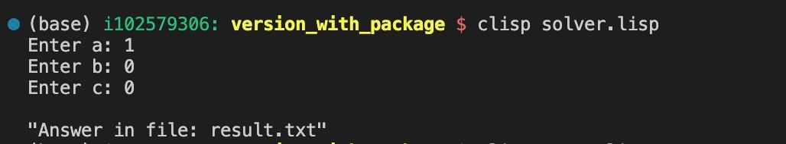
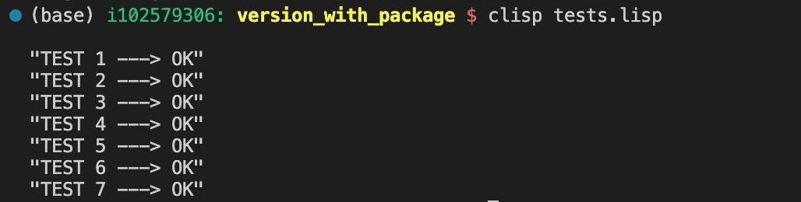
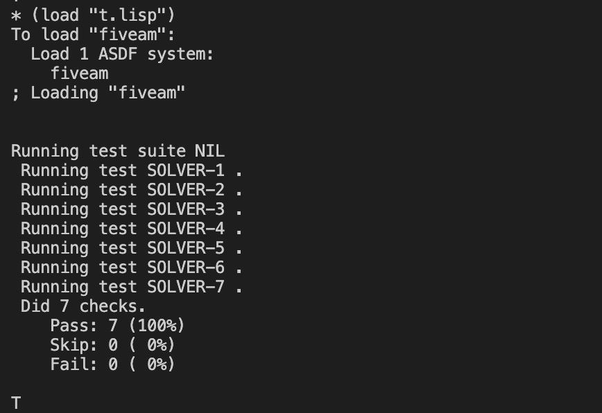

## Защита по лр №3

Написать программу, которая умеет решать квадратное уравнение и **тесты к ней**.

### Запуск

1. Запустить решатель 
   ```bash
   # разкомментить в файле solver.lisp последнюю строку (main)

   clisp solver.lisp 
   ```
   

   Если нужен будет результат выводить в консоль, то на 173 строке `(my_print (solver a b c))` поменять `my_print` на `print`.

2. Запустить ручные тесты
   ```bash
   clisp tests.lisp 
   ```
   
   

3. Запустить тесты fiveAM

   Установить fiveAM можно на официальном сайте https://www.quicklisp.org/beta/

   ```bash
   # Запускаем интерпретатор
   sbcl

   # В открывшейся консоли пишем
   (load "t.lisp")
   ```

   