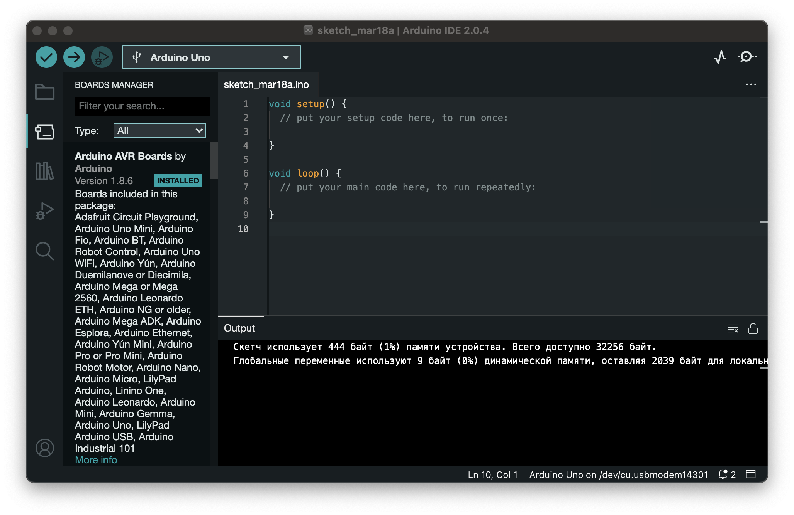
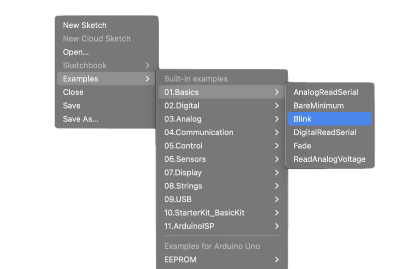
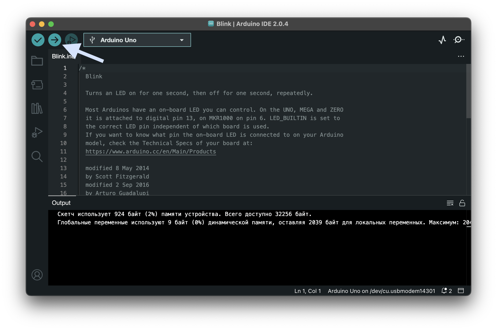
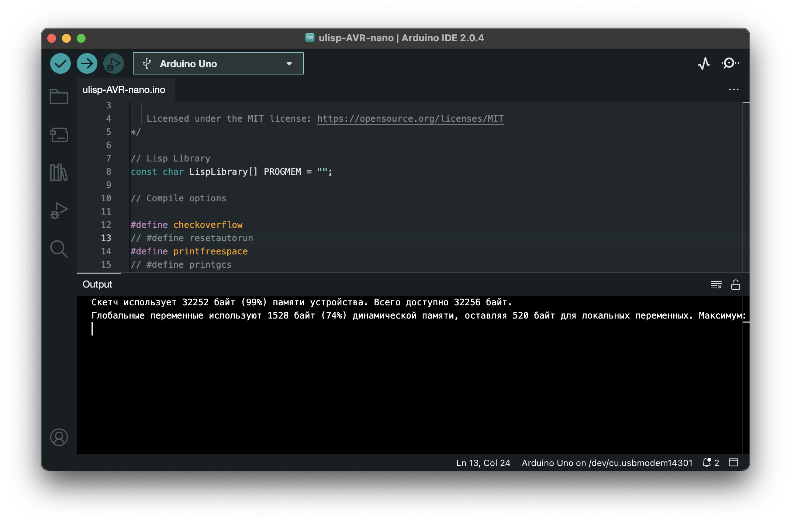
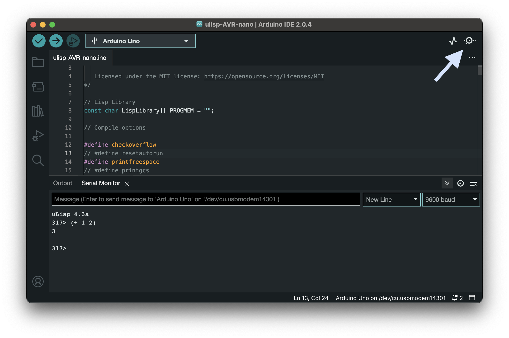
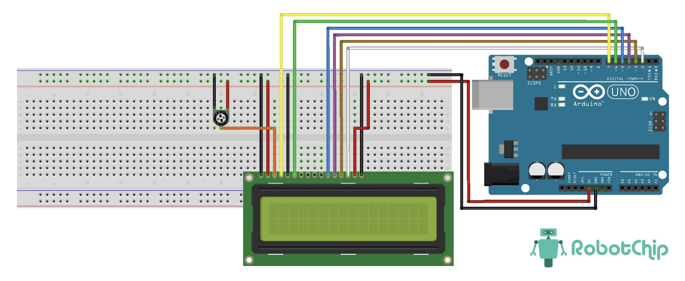
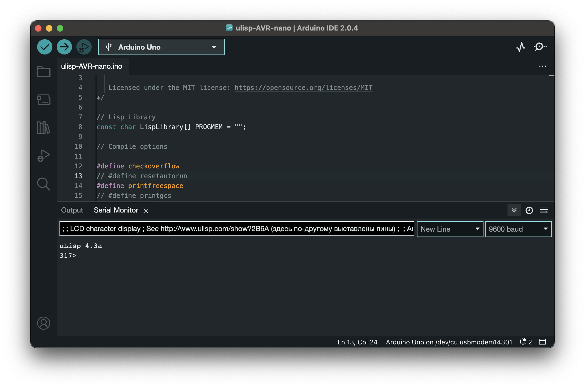
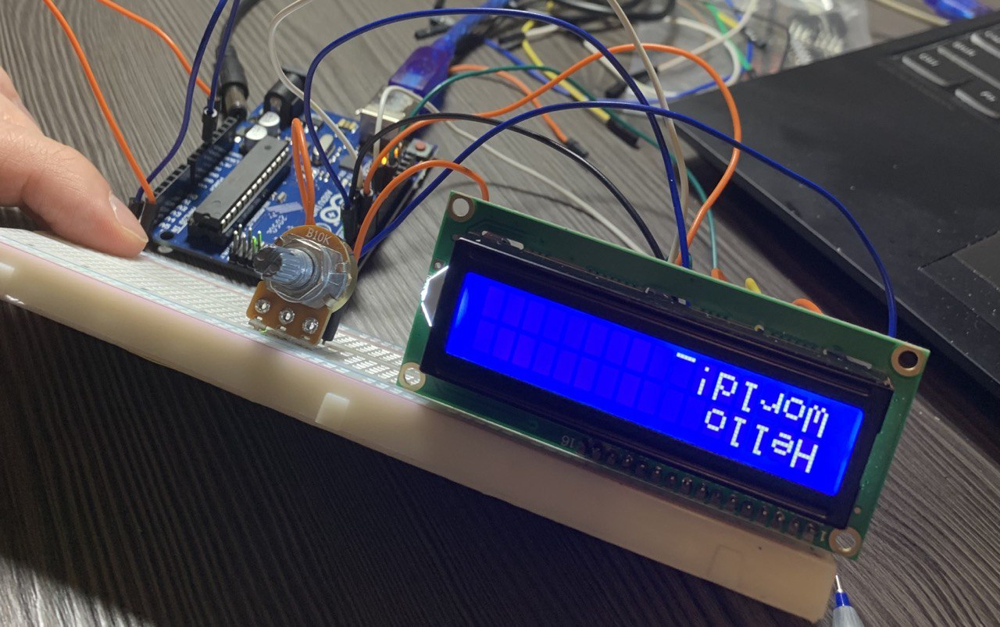

# Arduino, LСD и Lisp

Данная *статья* посвящена использованию языка Lisp на микроконтроллерах Arduino Uno с дисплеями LCD. 

## Установка

### Основы

Сначала разберемся с тем как вообще наладить взаимодействие ардуино и ноутбука. Cледующую часть можно пропустить, если вы уже что-то понимаете или если очень уверены в себе.

1. Установить Arduino IDE с официального сайта

   https://support.arduino.cc/hc/en-us/articles/360019833020-Download-and-install-Arduino-IDE

2. Подключить arduino к ноутбуку

3. Установить расширение Arduino AVD Boards (и возможно доп расширения, которые он сам предложит установить для вашей платы)

   

4. Проверить, что взаимодействие с ардуино налажено 

   * В меню во вкладке File выбираем

   

   * В открывшемся окне выбираем стрелочку 

   

   * Наслаждаемся мигающей лампочкой на ардуино

### Arduino и Lisp

Теперь сделаем из нашей ардуинки маленький интерпретатор языка Lisp.

1. Скачать репозиторий https://github.com/technoblogy/ulisp

2. Забрать оттуда файл `ulisp-AVR-nano.ino` и сохранить его в папку с названием `ulisp-AVR-nano`

3. Открыть его в среде Arduino IDE

4. Скомпилировать и залить его с помощью стреки 

   

5. Нажать Serial Monitror и в открывшейся строке написать простую команду лиспа, например `(+ 1 2)`. Ардуино вернула нам ответ 3, значит все хорошо.

   

### Добавляем LSD

Интерпретатор языка Лисп у нас есть, осталось научится выводить его ответы не в консоль Arduino IDE, а на экран LСD. 

1. Подкючаем LСD к ардуино, используя схему отсюда https://robotchip.ru/obzor-lcd-displeya-1602a/

   

2. Копируем этот код 

   ```lisp
   ;
   ; LCD character display
   ; See http://www.ulisp.com/show?2B6A (здесь по-другому выставлены пины)
   ;
   
   ; Arduino pins connected to D7 D6 D5 D4
   (defvar dat '(2 3 4 5))
   
   ; Arduino pins connected to E and RS
   (defvar en 6)
   (defvar rs 7)
   
   ; Initialise display
   (defun ini ()
     (mapc (lambda (x) (pinmode x t)) dat)
     (pinmode en t) 
     (pinmode rs t) 
     (cmd #x33)
     (cmd #x32)
     (cmd #x0e)
     (cmd #x01))
   
   ; Send command
   (defun cmd (c)
     (digitalwrite rs 0)
     (byt c)
     (digitalwrite rs 1))
   
   ; Send four bit nibble to display
   (defun nib (n)
     (let ((sh -4))
       (mapc (lambda (x) (digitalwrite x (logand (ash n (incf sh)) 1))) dat)
       (digitalwrite en 1)
       (digitalwrite en 0)))
   
   ; Send byte to display
   (defun byt (b)
     (nib (ash b -4))
     (nib (logand b #xf)))
   
   ; Send string to display
   (defun str (s)
     (dotimes (i (length s))
       (byt (char-code (char s i)))))
   
   ; Demo
   (defun go ()
     (str "Hello")
     (cmd #xc0)
     (str "World!"))
      
   ```

3. Отправляем его интерпретатору 

   

4. Отправляем еще две волшебные команды

   ```lisp
   (ini)
   (go)
   ```

5. Наслаждаемся выведенным Hello World на экране LCD

   


## Пример использования

Пусть есть функция (уменьшает на 10 все числа из списка-аргумента, проходя по верхнему уровню списковых ячеек) и тесты к ней

```lisp
(
    defun reduce_it_by_10 (lst)
        (mapcar (lambda (x) (if (numberp x) (- x 10) x)) lst)
)

(reduce_it_by_10 '())                   ; NIL
(reduce_it_by_10 '(1 2 3 4 5))          ; (-9 -8 -7 -6 -5)
(reduce_it_by_10 '(1 (2) 3 "4" 5))      ; (-9 (2) -7 "4" -5)
```

Тогда вывести результаты этих тестов на экран LCD можно следующим образом 

```lisp
(str (format nil "~a" (reduce_it_by_10 '())))                   ; NIL
(str (format nil "~a" (reduce_it_by_10 '(1 2 3 4 5))))          ; (-9 -8 -7 -6 -5)
(str (format nil "~a" (reduce_it_by_10 '(1 (2)))))              ; (-9 (2))
```

Другие примеры можно найти [здесь](https://github.com/Tulenenok/BMSTU_FaLP/tree/main/lisp/lab_05/src) 

## Полезные ссылки

* [Установка uLisp на разные платы](http://www.ulisp.com/show?1AA0)
* [Подключение LSD к Arduino Uno](https://robotchip.ru/obzor-lcd-displeya-1602a/)
* [LCD и uLisp](http://www.ulisp.com/show?2B6A)