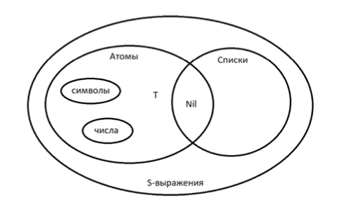
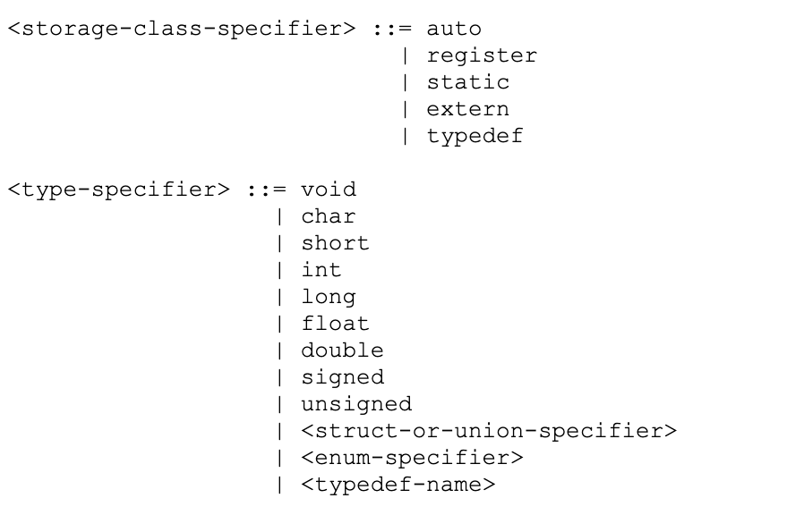
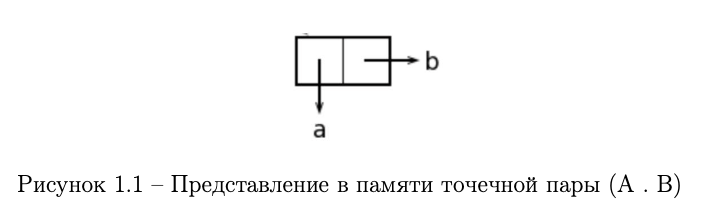
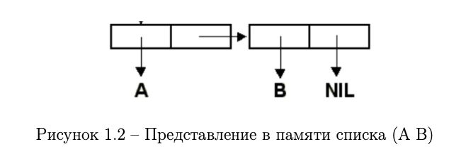

## Полезные ссылки

* [теория](https://github.com/Winterpuma/bmstu_FaLP/tree/master/CommonLisp/theory)
* [описания функций](http://catstail.narod.ru/homelisp/classic_funct.html)

## Вопросы

### Для Толпинской

- **Что такое список?** 

  Список - это структура данных. Может быть пустой и непустой. Если непустой, то состоит из двух элементов: первый(голова) - любой структуры(нет слова тип), а второй - список.

- **Что такое базис?**

  Базис - это минимально необходимый набор конструкций с помощью которого можно запрограммировать..

- **Что образует базис в лисп?** 

  Атомы, структуры, базовые функции, функционалы.

- **С помощью чего организованы списки в лисп?** 

  С помощью бинарных узлов/списковых ячеек, содержащих пару указателей (на голову и хвост)

- **В чем принципиальное отличие lisp от других языков?** 

  Lisp - язык символьной обработки. В Lisp программа и данные представлены списками.

- **Что собой представляет программа на лиспе?** 

  В lisp программа и данные представлены списками. По умолчанию список считается вычислимой формой в которой 1 элемент - название функции, остальные элементы - аргументы функции.

- **Как воспринимается символ '?** 

  Т.к. и программа и данные представлены списками, то их нужно как-то различать. Для этого была создана функция quote, а ' - ее сокращенное обозначение. quote - функция, блокирующая вычисление.

- **Где в памяти находятся списки в lisp?** 

  Списки динамические. В куче.

### Для Строганова 

* **Что такое AST?**

  Абстрактное синтаксическое дерево

  > Конечное помеченное ориентированное дерево, в котором внутренние вершины сопоставлены с операторами языка программирования, а листья - с соответствующими операндами. Таким образом, листья являются пустыми операторами и представляют только переменные и константы.

* **Как выглядит BNF у Lisp, C, C++?**

  BNF -- формальная система описания синтаксиса, в которой одни синтаксические категории последовательно определяются через другие категории.

  В лиспе я бы рассказала про такую картинку (+ см определение точечной пары и списка)

  

  Про С и С++ есть прикольное объяснение [здесь](https://cs.wmich.edu/~gupta/teaching/cs4850/sumII06/The%20syntax%20of%20C%20in%20Backus-Naur%20form.htm)

  

* lisp как ASMу?

* **ОПЗ, ПЗ?**

  Судя по всему ОПЗ (обратная польская запись) = постфиксная форма записи, ПЗ = префиксаня форма записи.

  У нас префиксая

* **Кто такие CAR, CDR?**

  Селекторы, базовые функции языка Лисп

  ```lisp
  CAR				; вернуть голову списка
  CDR				; вернуть хвост списка
  ```

* **`(cons 1 2)` `(list 1 2)` Списковые ячейки**

  ```lisp
  (cons 1 2)			; (1 . 2)
  (list 1 2)			; (1 2)
  ```

  

  

* **Как работает `quote`?**

  Функция quote блокирует вычисление своих аргументов = просто возващает аргументы, не вычисляя их

* **`(defvar x (cons 1 2))`**

  Определили переменную х ?

* **`(setf (cdr x) x)`**

  Записать в ячейку памяти новое значение

  `(setf ячейка-памяти значение)`

* **`(load ".lsp")`**

  Загрузить определения из файла