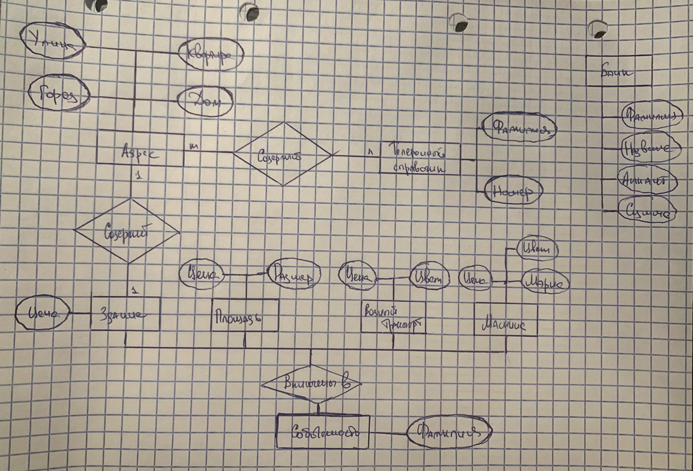

## Лабораторная работа №2 (8)

Создать базу знаний "Собственники", дополнив базу знаний, хранящую знания
* "телефонный справочник" (фамилия, телефон, адрес)
* "автомобили" (фамилия, марка, цвет, стоимость)
* "вкладчики банков" (фамилия, банк, счет, сумма)
* "собственность"
    * строение, стоимость
    * участок, стоимость
    * водный транстпорт, стоимость


Собственнось -- вариативный домен. Владелец может иметь не больше одного объекта каждого вида собственности.


Обеспечить следующие вопросы:
* Названия всех объектов собственности по фамилии владельца
* Названия и стоимость всех объектов собственности по фамилии владельца
* Суммарная стоимость всех объектов собственности по фамилии


### Что нам коротко дается в теоретических сведениях

**Prolog** -- декларативный язык программирования, при использовании которого решение задачи получается путем логического вывода из ранее известных положений.

**Программа на языке prolog** представлят собой набор фактов и правил. Или можно сказать базу знаний и вопрос.

**Предикат** -- набор фактов и правил, которые описывают одно знание, тем самым формируя *процедуру*.

**Вариативный домен**

```prolog
<имя вариационного домена> = <имя домена 1> ; ... ; <имя домена n>.
```

* `;` -- дизъюнкия
* `,` -- конъюнкиция

**Структура**

```prolog
<имя структуры> = 
    <имя функтора>(<имя домена 1> , ... , <имя домена n>) [; <имя функтора>(...)]*
```

`[...]*` означает возможность следования нескольких таких конструкций в описании.

### ER-диаграмма

Пока так..



### Запросы

* `A -> B`

  ```sql
  -- ЕЯ
  Выберите номер телефона из таблицы phone_t, объединенной с таблицей car_t по полю surname, где номер автомобиля равен заданному значению car_number
  ```

  ```sql
  -- SQL
  select 
  	A.*
  from A join B using(C);
  
  select 
  	phone
  from phone_t join car_t using(surname)
  where car_number = :car_number;
  ```

  ```sql
  -- Prolog
  get_phone_by_car_number(Phone, 111).
  ```

  ```sql
  -- MongoDB
  
  Этот запрос использует операцию $lookup, чтобы объединить данные из коллекции "phone_t" с данными из коллекции "car_t" на основе поля "surname". Затем операция $match фильтрует результаты по полю "car_number". Наконец, операция $project выбирает только поле "phone" для каждого документа. Результатом запроса будет список всех телефонов, связанных с автомобилем, у которого номер равен :car_number.
  
  db.phone_t.aggregate([
    {
      $lookup:
        {
          from: "car_t",
          localField: "surname",
          foreignField: "surname",
          as: "car_info"
        }
    },
    {
      $match:
        {
          "car_info.car_number": :car_number
        }
    },
    {
      $project:
        {
          "phone": 1
        }
    }
  ])
  ```

* `B -> A`

  ```sql
  -- ЕЯ
  Выберите номер машины из таблицы car_t, объединенной с таблицей phone_t по полю surname, где номер телефона равен заданному значению phone
  ```

  ```sql
  -- SQL
  select 
  	B.*
  from A join B using(C);
  
  select 
  	car_number
  from phone_t join car_t using(surname)
  where phone = :phone;
  ```

  ```sql
  -- Prolog
  get_phone_by_car_number(999, Car).
  ```

  ```sql
  -- MongoDB
  db.phone_t.aggregate([
    { $match: { phone: <phone> } },
    { $lookup: { from: "car_t", localField: "surname", foreignField: "surname", as: "cars" } },
    { $project: { car_number: "$cars.car_number", _id: 0 } }
  ])
  ```

* `-> A, B`

  ```sql
  -- ЕЯ
  Выбрать телефон и машину из таблицы phone_t, объединенной с таблицей car_t по фамилии.
  ```

  ```sql
  -- SQL
  select 
  	*
  from A join B using(C);
  
  select 
  	phone, car
  from phone_t join car_t using(surname);
  ```

  ```sql
  -- Prolog
  get_phone_by_car_number(Phone, Car).
  ```

  ```sql
  -- MongoDB
  db.phone_t.aggregate([
    { $lookup: { from: "car_t", localField: "surname", foreignField: "surname", as: "cars" } },
    { $project: { phone: 1, car: "$cars.car_number", _id: 0 } }
  ])
  ```

  

  

  
