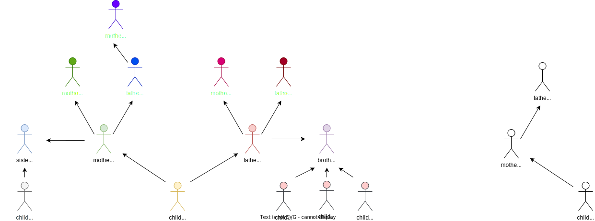

# Лабораторная работа №3

## Задание 1

Создать базу знаний "предки". Варианты вопросов:

1. По имени субъекта определить всех его бабушек
2. По имени субъекта определить всех его дедушек
3. По имени субъекта определить всех его бабушек и дедушек
4. По имени субъекта определить его бабушку по материнской линии
5. По имени субъекта определить его бабушку и дедушку по материнской линии

## Задание 2

Дополнить базу знаний правилами, позволяющими найти

1. Максимум из двух чисел (без и с использованием отсечения)
2. Максимум из трех чисел (без и с использованием отсечения)

## Защита от Строгонова 1

Создать базу знаний "5 видов родственников". Сравнить запросы к ней на прологе, естесственном языке и графовой СУБД Neodje.

База знаний выглядит примерно следующим образом:



### Neo

**Как все создать**

Описала в файле `create_db.cypher`.

**Как все вывести**

```
MATCH p=()-[:Child|Parent|Sibling]->() RETURN p LIMIT 30;
```


**Как все удалить**
```
match (n)
detach delete n
```

**Как что-нибудь получить**

* Получить бабушек и дедушек для `child_a`.

    ```sql
    -- Prolog
    grandparent(child_a, Grand, _, _).

    -- где
    grandparent(Child_, GrandParent_, ParentSex_, GrandParentSex_) :-
        parent(Child_, Parent_, ParentSex_),
        parent(Parent_, GrandParent_, GrandParentSex_).
    ```

    ```cypher
    match (p3:Person)-[:Parent]->(p2:Person)
    match (p2:Person)-[:Parent]->(p1:Person{name:"child_a"})
    return p3.name;
    ```


* Получить прабабушек и прадедушек для `child_a`.

    ```sql
    -- Prolog
    grandgrandparent(child_a, GrandGrandMother, _, _, _).

    -- гдe
    grandgrandparent(Child_, GrandGrandParent_, ParentSex_, GrandParentSex_, GrandGrandParentSex_) :-
        grandparent(Child_, GrandParent_, ParentSex_, GrandParentSex_),
        parent(GrandParent_, GrandGrandParent_, GrandGrandParentSex_).
    ```

    ```cypher
    match (p4:Person)-[:Parent]->(p3:Person)
    match (p3:Person)-[:Parent]->(p2:Person)
    match (p2:Person)-[:Parent]->(p1:Person{name:"child_a"})
    return p4.name;
    ```

* Получить бабушек для `child_a`.

    ```sql
    -- Prolog
    grandparent(child_a, Grand, _, f).

    -- где
    grandparent(Child_, GrandParent_, ParentSex_, GrandParentSex_) :-
        parent(Child_, Parent_, ParentSex_),
        parent(Parent_, GrandParent_, GrandParentSex_).
    ```

    ```cypher
    match (p3:Person{sex:"f"})-[:Parent]->(p2:Person)
    match (p2:Person)-[:Parent]->(p1:Person{name:"child_a"})
    return p3.name;
    ```

* Получить всех дедушек по материнской линии

    ```sql
    -- Prolog
    grandparent(child_a, Grand, f, m).

    -- где
    grandparent(Child_, GrandParent_, ParentSex_, GrandParentSex_) :-
        parent(Child_, Parent_, ParentSex_),
        parent(Parent_, GrandParent_, GrandParentSex_).
    ```

    ```cypher
    match (p3:Person{sex:"m"})-[:Parent]->(p2:Person{sex:"f"})
    match (p2:Person{sex:"f"})-[:Parent]->(p1:Person{name:"child_a"})
    return p3.name;
    ```
