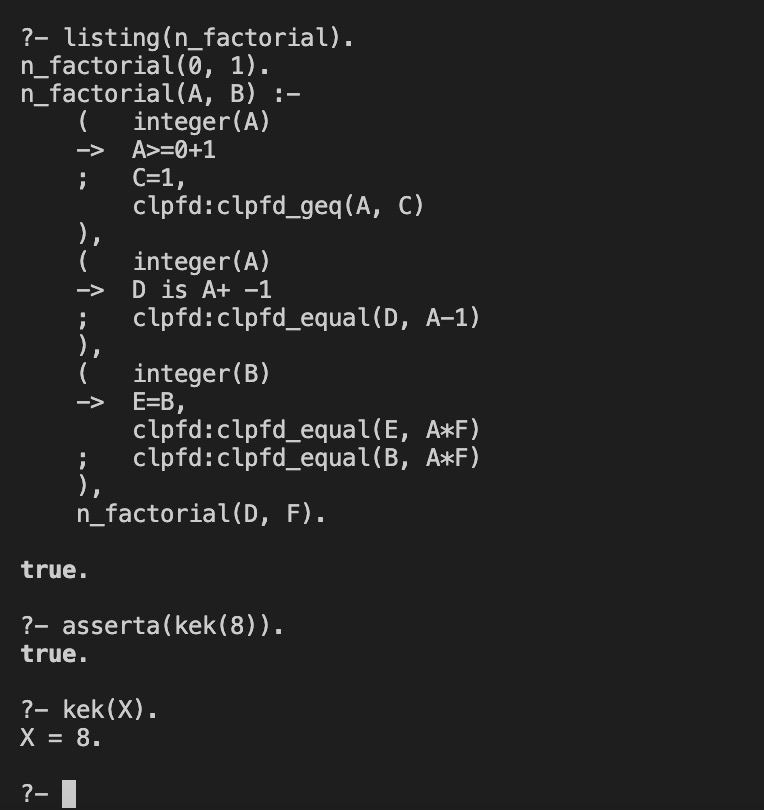
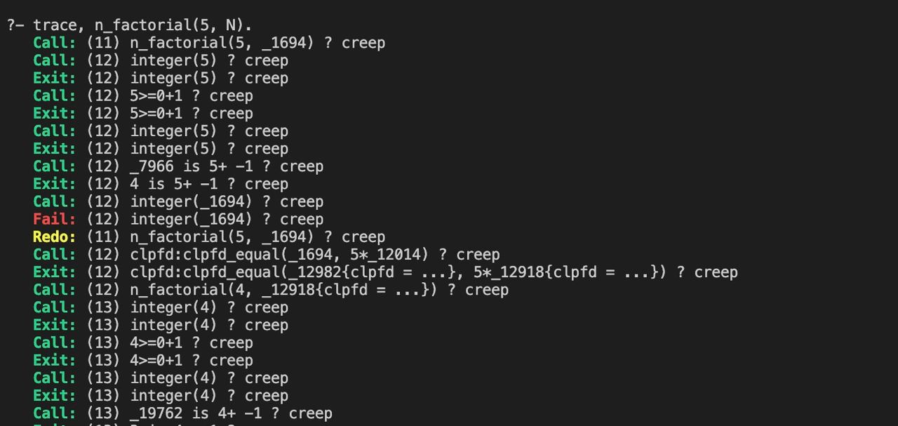

## Лабораторная работа №4 (9)

Написать факториал и числа Фибонначи.

### Защита

Написать числа Фибонначи и факториал с помощью хвостовой рекурсии, на swi-прологе.

Некоторые команды запуска:

```
brew install swi-prolog
swipl protection_02.pro
    ?- fibonacci(R, 5).
    ?- n_factorial(N, 120).
    ?- trace, n_factorial(5, N).
    ?- listing(n_factorial).
    ?- asserta(kek(8)).
    ?- kek(X).
       X = 8.
```



